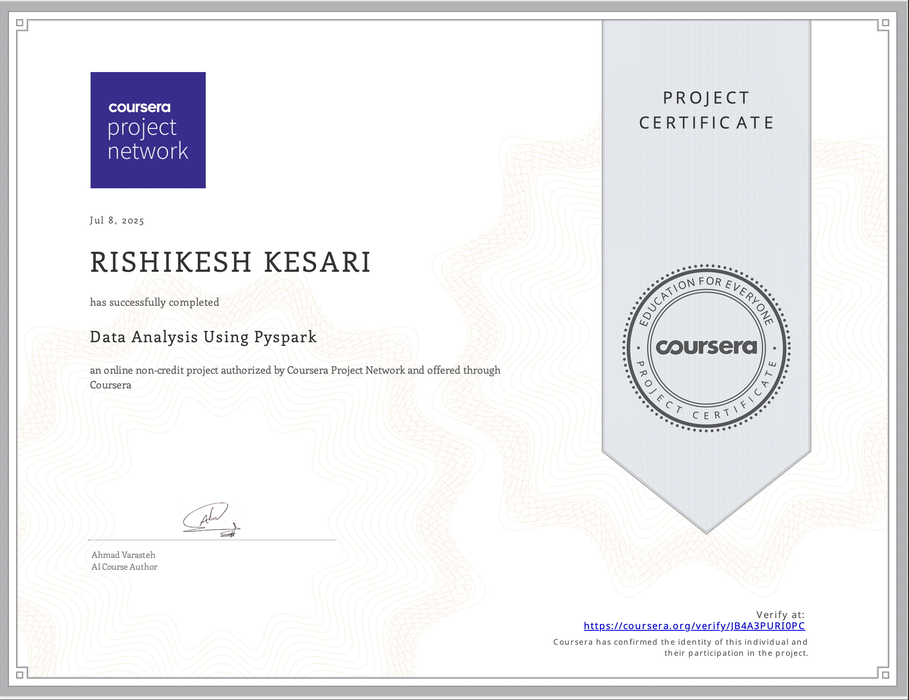
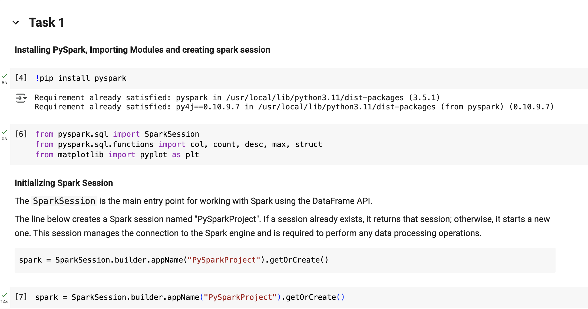
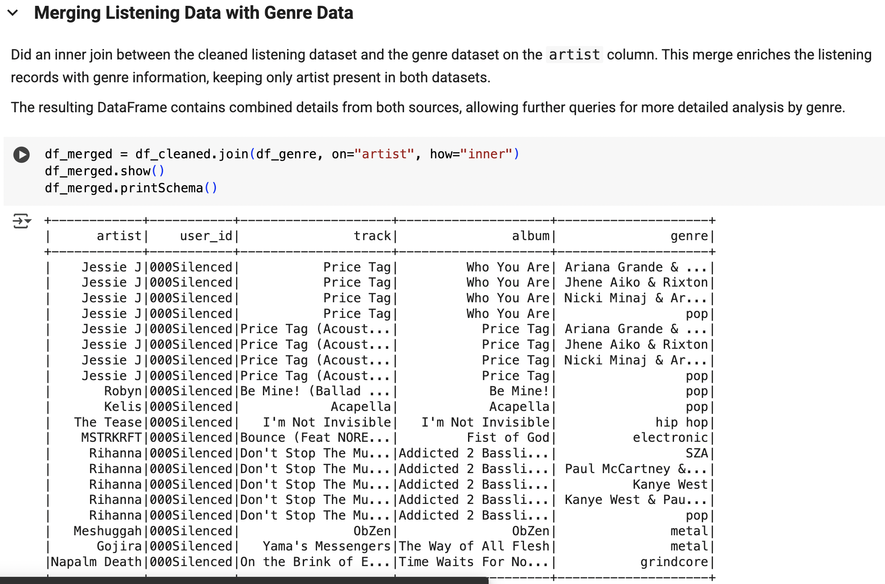
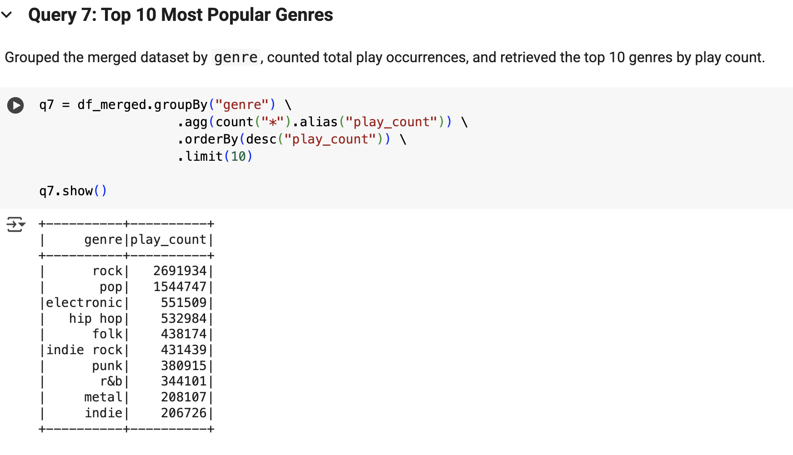

# Using PySpark for Big Data Analytics

    

---

Analyzed over **13 million rows** (13,758,905) of music listening data using **PySpark** on **Google Colab**.  
This project demonstrates how distributed data processing can efficiently handle big data tasks such as cleaning, querying, joining, and visualizing— all at scale, using Google Colab.

---

## Skills Gained & Applied

- Big data analytics using **PySpark**
- Data cleaning & transformation
- SQL-style queries and aggregations
- Joining datasets
- Visualizing results with **Matplotlib**
- Working in **Google Colab** cloud environment

---

## Dataset

- `listenings.csv` – User listening history (13M+ rows)
- `genre.csv` – Artist-genre mapping

---

## Some images from the project

## Tasks Overview

### ✅ Task 1: Setup
- Mounted Google Drive
- Installed PySpark
- Created Spark session

### ✅ Task 2: Load & Explore Data
- Loaded `listenings.csv`
- Checked schema and null values
- Dropped `date` column
- Removed null records
- Verified shape (~13.7M rows)

### ✅ Task 3: Queries on Main Dataset
- Filtered listening history by artist (e.g., Rihanna)
- Found top users, top tracks, and top albums
- Aggregated listening behavior

### ✅ Task 4: Merge Datasets
- Loaded `genre.csv`
- Performed **inner join** on `artist` to enrich data with genre info

### ✅ Task 5: Genre Analytics
- Identified users’ favorite genres (using `Window` & `Struct` methods)
- Counted artists per genre (pop, rock, metal, hip hop)
- Visualized genre-wise artist distribution with bar chart

---

## Certificate

([Certificate of Completion from Coursera](https://coursera.org/share/ee1e071b24629c33202b8de674074d1b))

---

## Full data analysis code in python is found 
[here](https://github.com/rishi-analytics/big-data-analysis-using-pyspark/blob/main/big_data_analysis_using_pyspark.ipynb)

